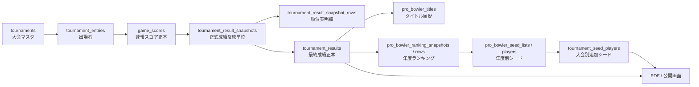

# JPBAリニューアル 自動化ロードマップ

作成日: 2026-06-23

## 目的

公開サイトの見た目と導線は現行JPBAサイトの利用感を維持しながら、裏側はDBを正本にして、手作業で行っている反映作業を段階的に自動化する。

特に優先するもの:

- スコア入力から速報、正式成績、年間ランキング、タイトル、シード、PDFまでを同じDB正本からつなぐ
- PHPファイルと責務を整理し、巨大Controllerへ集まった処理をServiceへ移す
- OCR/写真解析は直接DBへ書かず、必ず確認用ステージングを経由する
- 人間が確認すべきタイミングを画面上で明確にし、誤反映を防ぐ

## 現時点の正本フロー

## 現在すでにある自動化

- `ScoreController` / `ScoreService`
  - `game_scores` への速報入力、ステージ別の順位表示、ラウンドロビン・シュートアウト・トーナメント形式の入力補助。
- `TournamentResultSnapshotController` / `TournamentResultSnapshotService`
  - `game_scores` から正式成績snapshotを作成。
  - 全体条件の最終snapshotは `tournament_results` へ同期する設計。
- `TournamentResultController`
  - 最終成績の表示、PDF出力、賞金・ポイント反映、タイトル同期。
- `RankingController`
  - 公式ランキング本文の取込と `pro_bowler_ranking_snapshots` / `pro_bowler_ranking_rows` への保存。
- `ProBowlerSeedListController` / `ProBowlerSeedService`
  - 年度別シード生成、大会別シード展開、PDF用の `S` 表示判定。
- `TournamentSeedPlayerController`
  - 大会別追加シード、歴代優勝者枠、優先出場PDFの確認。

## 今回追加した制御盤

`/tournaments/{tournament}/operation-logs` の既存「大会運用ログ」に、大会終了処理チェックリストを追加した。

追加した集計Service:

- `app/Services/TournamentAutomationReadinessService.php`

この画面では以下を1つの流れとして確認できる。

1. エントリー確認
2. スコア入力
3. 正式成績反映
4. 賞金・ポイント反映
5. タイトル同期
6. シード確認
7. PDF確認

まだ完全自動実行にはしない。まずは既存の反映機能を同じ画面へ集め、確認しながら押せる状態にする。これが将来の「大会終了処理を一括実行」ボタンの土台になる。

2026-06-23追記:

- エントリー人数とスコア入力済み選手数の差分を検知する。
- `stage_settings` の設定ゲーム数に対して、入力済みゲームが不足しているステージを検知する。
- 全体final snapshot行数と `tournament_results` 件数の差分を検知する。
- 賞金・ポイント、タイトル、シードの未反映候補を「要確認リスト」として表示する。

## 次の実装順

### Phase 1: 大会終了処理の一本化

- チェックリスト画面で不足状態をより詳しく出す
  - 選手単位の未入力一覧
  - ステージごとのゲーム数不足
  - final snapshot はあるが `tournament_results` に同期されていない状態
  - 賞金/ポイント配分はあるが未反映の状態
- 反映操作をログに残す
  - 誰が、いつ、どの処理を実行したか
  - 成功/失敗/件数/エラー内容
- 古い `TitleSyncController` と新しい `TournamentResultController::syncTitles` の責務を整理し、正本ルートを1つにする。

### Phase 2: スコア取込の標準化

- 写真OCRの前に、CSV/Excel取込を実装する。
- 取込先は直接 `game_scores` ではなく、確認用の一時テーブルにする。
- 画面上で照合結果を確認してから `game_scores` へ確定反映する。

推奨テーブル案:

- `score_import_batches`
- `score_import_rows`
- `score_import_row_candidates`

### Phase 3: OCR/写真解析

- 紙の成績表を写真アップロードする。
- OCR/AI解析結果を `score_import_rows` に保存する。
- 選手名・ライセンスNo・ゲーム番号・スコアの信頼度を表示する。
- 信頼度が低いセルだけ人間が直し、確定後に `game_scores` へ反映する。

重要な運用ルール:

- OCR結果は正本ではない。
- `game_scores` に入ったものだけを速報・正式成績の正本とする。
- 確定前の解析結果でタイトル、ランキング、シード、PDFを更新しない。

### Phase 4: 公開サイト互換

- 現行JPBA1サイトに近い見た目、メニュー、一覧、PDF導線を維持する。
- 公開側はできるだけDB正本を読むだけにする。
- 管理側の入力・反映・確認機能とは分離する。

## 当面の判断

- 最初から全自動にしない。
- まず「どのDBを正本にするか」と「どの画面で確認するか」を固定する。
- 自動反映は、人間が確認したあとに押すボタンとして作る。
- 反映ログを残せるようになってから、一括実行や定期実行へ進める。
